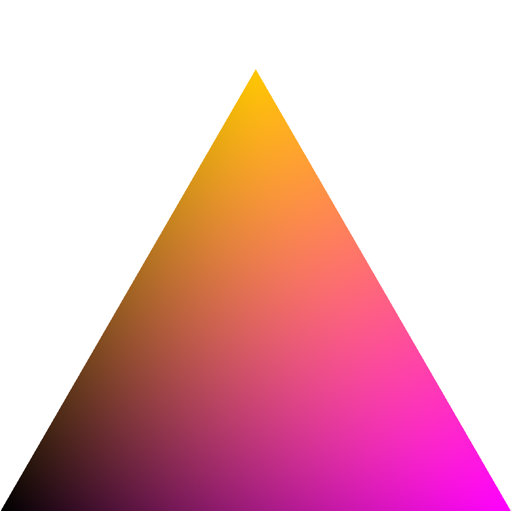
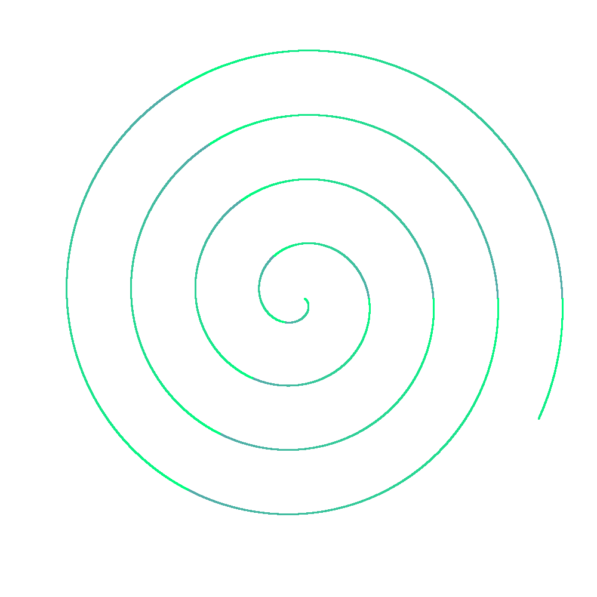
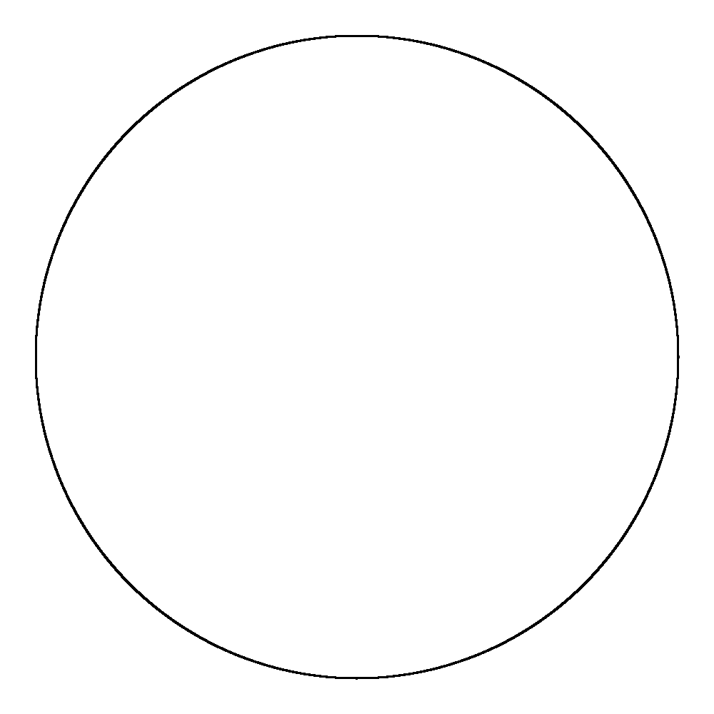
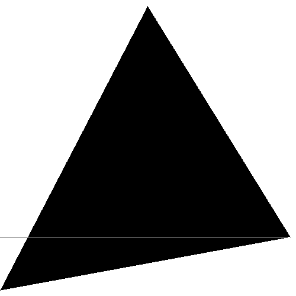
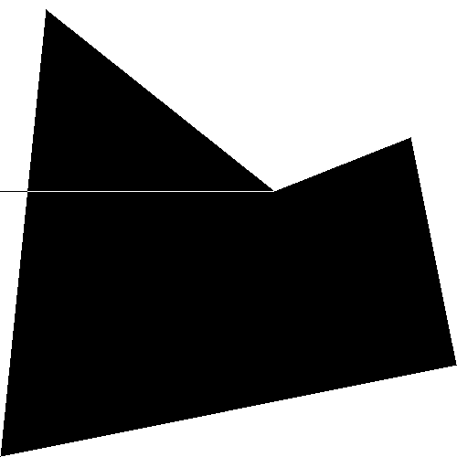
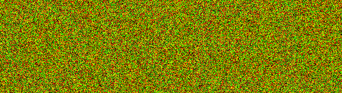
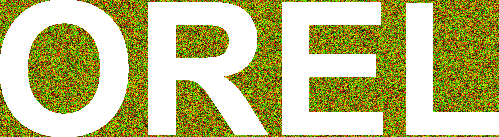
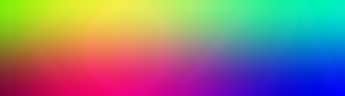
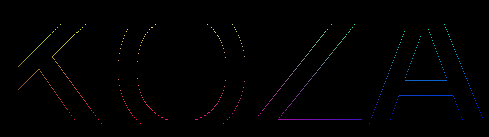

## Bitmap graphics
[Home](../)

Témou tohto cvičenia bola práca s bitmapovou grafikou, respektíve precvičovanie reprezentácie obrázkov v 2D mriežke.

Najskôr bolo úlohou vykresliť niekoľko rovinných útvarov parametricky alebo všeobecne.

    
    
    

Ďalšia úloha bola vypĺňanie (aj nekonvexných) mnohouholníkov. Pri tejto úlohe som používal ray tracing z každého bodu na zistenie, či daný bod patrí alebo nepatrí do mnohouholníka. Na obrázku nižšie je vidieť výstup, ktorý však obsahuje chybu v podobe čiernej horizontálnej čiary. Táto chyba (môže sa vyskytnúť len pri vrcholoch) je spôsobená tým, že pri vykresľovaní čiar máme istú toleranciu a teda bod (vrchol) ktorý by mal byť aj na plátne reprezentovaný práve jedným bodov je reprezentovaný viacerými a v takýchto prípadoch ray tracing nefunguje veľmi dobre. 

    
    

Ďalšou úlohou bolo implementovať niektoré (aj vlastné) optické klamy. Táto úloha však zatiaľ nie je implementovaná.

Posledná úloha bola tvorená troma skrývačkami, respektíve odkazmi skrytími v obrázkoch:

- V tejto skrývačke stačilo skryť pixely, ktoré neobsahujú modrú zložku farby.

- V tejto skladačke bolo treba skúmať nárast jednotlivých zložiek farieb, respektíve ich zmeny a následne zvýrazniť miesta, kde bol prechod medzi farbami výraznejší.

- Posledná skrývačka využívala XOR mriežku, tj najskôr bolo treba vymyslieť mriežku takú, aby sa po jej aplikovaní na vstupný obrázok ukázal správny výstup. Mriežka, ktorá fungovala v tomto prípade bola šachovnicová, tj. striedali sa v nej biela a čierna farba, ako je vidieť na obrázku.

    
##### Výstup z konsole po spustení jar archívu sa nachádza [tu](./console-output.md)
##### Všetky ostatné obrázky(výstupy) k tejto úlohe sa nachádzajú na [Github-e](https://github.com/mseleng/iv122/tree/gh-pages/iv122_outputs/assignment4)
##### Všetky ostatné kódy k tejto úlohe sa nachádzajú na [Github-e](https://github.com/mseleng/iv122/tree/gh-pages/src/com/github/mseleng/iv122/assignment4)
##### Dokumentácia ku kódu sa nachádza [tu](../javadoc/iv122/com.github.mseleng.iv122.assignment4)