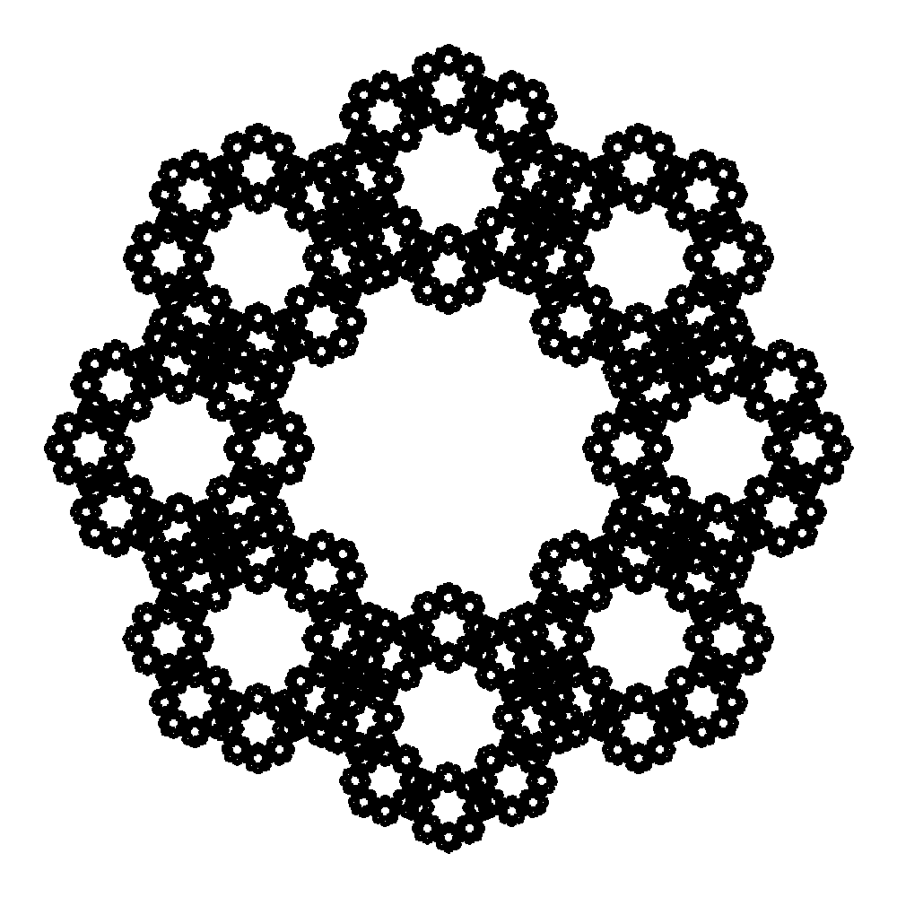
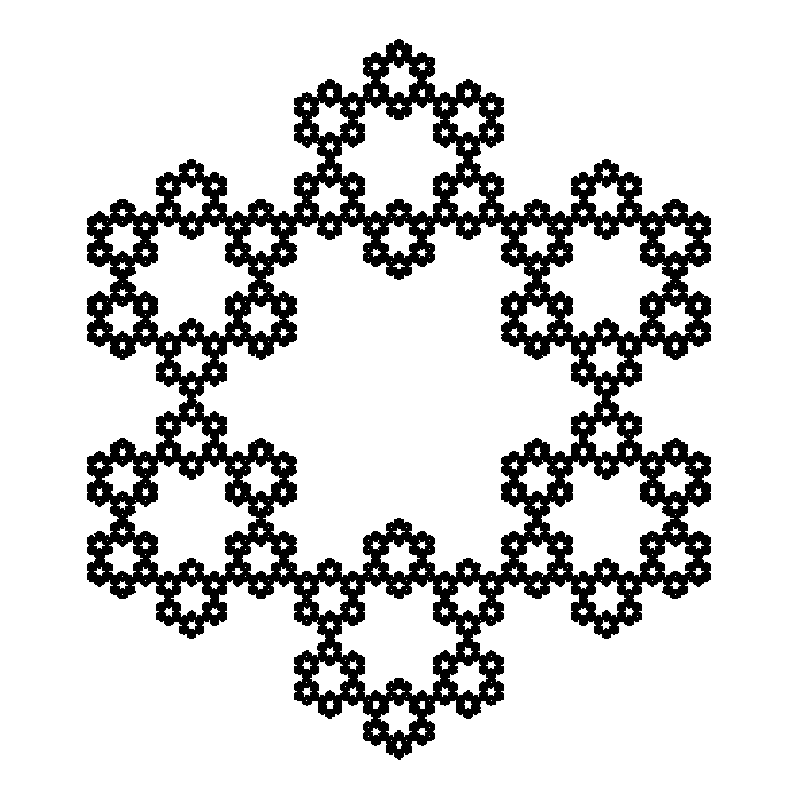
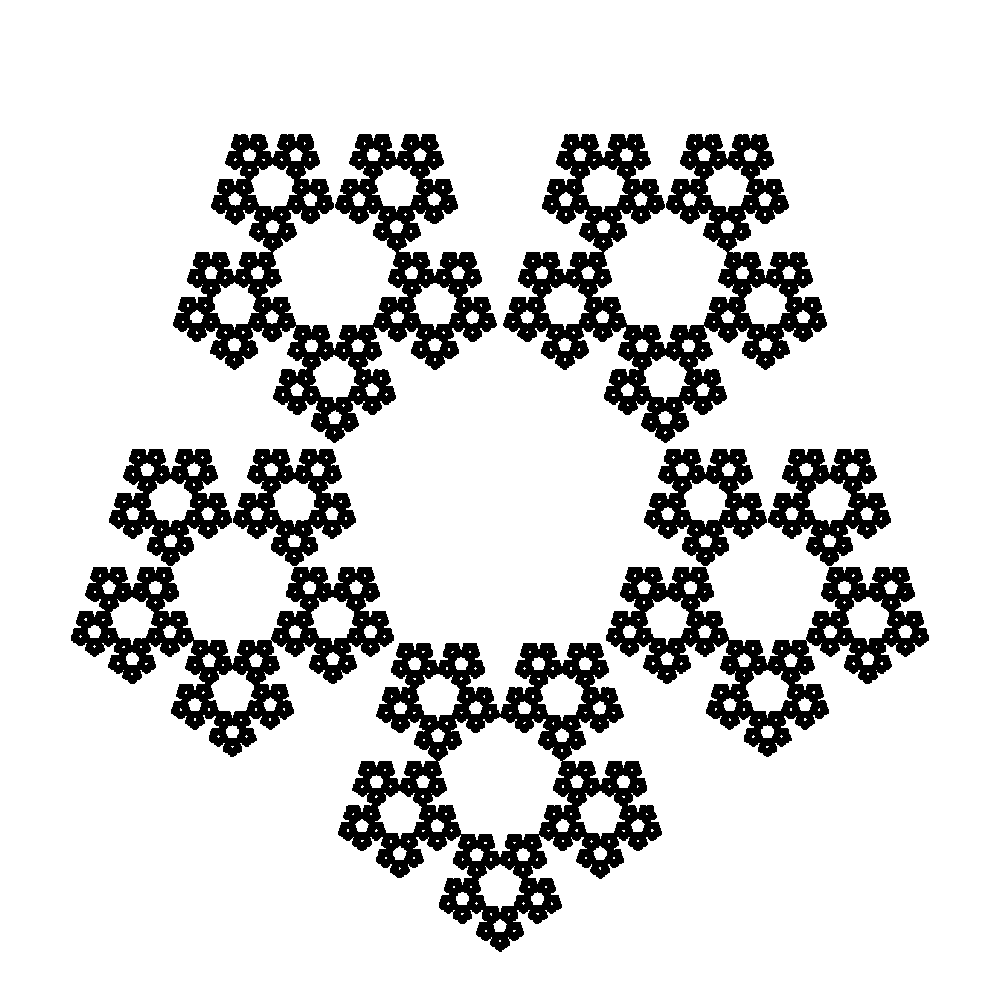

## Chaos a fraktály
[Home](../)

V prvej časti sme sa zameriavali na tzv. chaos game, tj. stav, keď (takmer) náhodne rozmiestnené body začnú po istom časte formovať pravidelné obrazce. Ja som chaos game implementoval len pre pravidelné mnohouholníky. Niektoré výstupy sú zobrazené nižšie.

<div align="center" style="width:90%">
    <a href="../iv122_outputs/assignment6/octagon.png"></a>
    <a href="../iv122_outputs/assignment6/octagon-2.png"></a>
    <a href="../iv122_outputs/assignment6/octagon-3.png"></a>
</div>

<div align="center" style="width:90%">
    <a href="../iv122_outputs/assignment6/hexagon.png"></a>
    <a href="../iv122_outputs/assignment6/pentagon-2.png"></a>
    <a href="../iv122_outputs/assignment6/sierpinski-triangle.png"></a>
</div>

Ďalšou úlohou bolo naimplementovať L-systémy. Mojim cieľom bolo L-systémy naimplementovať čo najprehľadnejšie a tak, aby len stačilo rozšíríť triedu `Turtle`. Myslím si, že tento cieľ sa mi podarilo splniť veľmi dobre, keďže jediné rozšírenie triedy `Turtle` som spravil tak, že som len pridal ďalší konštruktor:

```kotlin
constructor(lSystem: LSystem, depth: Int, initialState: State): this(initialState) {
    var result = lSystem.axiom

    depth.timesRepeat {
        val stringBuilder = StringBuilder()
        result.forEach {
            stringBuilder.append(lSystem.grammarRules[it] ?: it.toString())
        }
        result = stringBuilder.toString()
    }

    result.forEach {
        lSystem.turtleRules.getOrDefault(it, StandStill()).function.invoke(this)
    }
}
```

V tomto konštruktore sa odohráva prepisovanie pravidiel gramatiky a aj následná interpretácia pokynov korytnačkou.

Trieda `LSystem` je definovaná nasledovne:

```kotlin
class LSystem(val axiom: String, val grammarRules: LSystemGrammarRules, val turtleRules: LSystemTurtleRules)
```

kde alias `LSystemGrammarRules` slúži na ukladanie pravidiel prepisovania a je definovaný takto:

```kotlin
typealias LSystemGrammarRules = Map<Char, String>
```

a alias `LSystemTurtleRules` slúži na asociáciu pohybov korytnačky so znakmi v L-systéme:

```kotlin
typealias LSystemTurtleRules = Map<Char, TurtleDirections>
```

Trieda `TurtleDirections` je Kotlinovská obdoba známych enumeračných typov (Kotlin obsahuje podporu aj pre enumerácie `enum class`) s tým, že jednotlivým "prípadom" enumerácie je možné pridávať rôzne properties. Trieda (a niektoré z jej "možností") je definovaná takto:

```kotlin
sealed class TurtleDirections(val function: Turtle.() -> Unit)
class Forward(amount: Double) : TurtleDirections({ forward(amount) })
class Left(degrees: Double) : TurtleDirections({ left(degrees) })
class Pop : TurtleDirections({ popStack() })
class Custom(function: Turtle.() -> Unit): TurtleDirections(function)
//...
```

Použitie takéhoto návrhu môže vyzerať napríklad takto:

```kotlin
Turtle(
    LSystem(
            "-A+B+A",
            mapOf(
                    'A' to "B-A-B",
                    'B' to "A+B+A"),
            mapOf(
                    'A' to Forward(3.0),
                    'B' to Forward(9.0),
                    '+' to Right(60.0),
                    '-' to Left(60.0))),
    6,
    Turtle.State(position = Coordinates(10, 690)))
```

Toto je kôd, ktorý generuje Sierpińského trojuholník. Ostatné príklady na použitie tohto návrhu je možné nájsť v [tomto súbore](https://github.com/mseleng/iv122/blob/master/src/com/github/mseleng/iv122/assignment6/B.kt).

Niektoré obrázky, ktoré som vygeneroval pomocou L-systémov:

<div align="center" style="width:90%">
    <a href="../iv122_outputs/assignment6/plant-1.svg"></a>
    <a href="../iv122_outputs/assignment6/plant-2.svg"></a>
    <a href="../iv122_outputs/assignment6/plant-3.svg"></a>
</div>

Na nasledujúcich obrázkoch som sa snažil demonštrovať ako veľmi sa dokáže pravidelný obrazec rozhádzať len tým, že jemne pozmeníme uhol rotácie:

  + Hilbertova space-filling krivka (na prvom obrázku rotácia o 90° vľavo aj vpravo, na druhom obrázku 89° vľavo a 91° vpravo)
  
  <div align="center" style="width:80%">
      <a href="../iv122_outputs/assignment6/hilbert-l-system.svg"></a>
      <a href="../iv122_outputs/assignment6/hilbert-l-system-89-91.svg"></a>
  </div>

  + Kochov ostrov (na prvom obrázku rotácia o 90° vľavo aj vpravo, na druhom 89.7° vľavo, respektíve 90.2° vpravo)
  
  <div align="center" style="width:80%">
      <a href="../iv122_outputs/assignment6/koch-island-l-system.svg"></a>
      <a href="../iv122_outputs/assignment6/koch-island-l-system897-902.svg"></a>
  </div>
  
Poslednou úlohou bola implementácia diagramu bifurkácie a to tak, aby sa vo funkcii, ktorá tento diagram vykresľuje dal zvoliť "výrez", ktorý sa má zobraziť. Funkciu som implementoval jednoducho:

```kotlin
fun feigenbaum(width: Int, height: Int, rRange: Pair<Double, Double>, xRange: Pair<Double, Double>): BufferedImage {
    val img = bitmapImage(width, height)
    val wStep = (rRange.second - rRange.first) / (width-1)
    val hStep = (xRange.second - xRange.first) / (height-1)

    for (rX in 0..img.width - 1) {
        var x = 0.01
        val r = rX * wStep + rRange.first
        100.timesRepeat {
            x *= 4 * r * (1 - x)
        }
        100.timesRepeat {
            x *= 4 * r * (1 - x)
            if (x in xRange.first..xRange.second) {
                val y = Math.round(height - 1 - (x-xRange.first)/hStep).toInt()
                img.setRGB(rX, y, Color.BLACK.rgb)
            }
        }
    }

    return img
}
```

a tu sú niektoré výstupy:

  + (r∈[0.0;1.0], x∈[0.0;1.0])
  
  <p align="center"><a href="../iv122_outputs/assignment6/feigenbaum-0_00|1_00-0_00|1_00.png"></a></p>
  
  + (r∈[0.85;1.0], x∈[0.0;1.0])
  
  <p align="center"><a href="../iv122_outputs/assignment6/feigenbaum-0_85|1_00-0_00|1_00.png"></a></p>
  
  + (r∈[0.85;0.9], x∈[0.8;0.9])
  
  <p align="center"><a href="../iv122_outputs/assignment6/feigenbaum-0_85|0_90-0_80|0_90.png"></a></p>
  
##### Výstup z konsole po spustení jar archívu sa nachádza [tu](./console-output.md)
##### Všetky ostatné obrázky(výstupy) k tejto úlohe sa nachádzajú na [Github-e](https://github.com/mseleng/iv122/tree/gh-pages/iv122_outputs/assignment6)
##### Všetky ostatné kódy k tejto úlohe sa nachádzajú na [Github-e](https://github.com/mseleng/iv122/tree/gh-pages/src/com/github/mseleng/iv122/assignment6)
##### Dokumentácia ku kódu sa nachádza [tu](../javadoc/iv122/com.github.mseleng.iv122.assignment6)