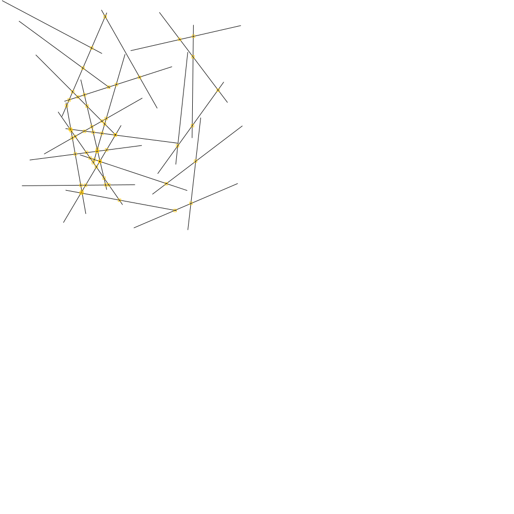

## Geometrické algoritmy
[Home](../)

Toto cvičenie pokrývalo základné geometrické algoritmy:

+ Nájdenie priesečníkov úsečiek:

<div align="center" style="width:90%">
    <a href="../iv122_outputs/assignment5/lines.svg"></a>
    <a href="../iv122_outputs/assignment5/lines-2.svg"></a>
</div>

+ Nájdenie "peknej" triangulácie:
  - Nie je implementvané

+ Nájdenie konvexného obalu bodov:

<p align="center"><a href="../iv122_outputs/assignment5/hull.svg"></a></p>

Jednotlivé úlohy na seba navzájom naväzovali, pričom v každej úlohe boli potrebné funkcie na generovanie `n` náhodných bodov:

```kotlin
fun randomPoints(n: Int, maxX: Int, maxY: Int): List<Coordinates> {
    val randomX = Random()
    val randomY = Random()
    return (1..n).asIterable()
            .map { Coordinates(randomX.nextDouble() * maxX, randomY.nextDouble() * maxY) }
}
```

respektíve na generovanie náhodných úsečiek rovnakej dĺžky:

```kotlin
fun randomLines(n: Int, maxX: Int, maxY: Int, length: Double): List<Line> {
    val degreeRandom = Random()

    return randomPoints(n, maxX, maxY)
            .map {
                var coords: Coordinates
                do {
                    val randomDegree = degreeRandom.nextDouble() * 360
                    val x = length * Math.cos(Math.toRadians(randomDegree))
                    val y = length * Math.sin(Math.toRadians(randomDegree))
                    coords = Coordinates(it.x + x, it.y + y)
                } while (coords.isOutOfRange(maxX, maxY))
                Line(it, coords)
            }
}
```

##### Výstup z konsole po spustení jar archívu sa nachádza [tu](./console-output.md)
##### Všetky ostatné obrázky(výstupy) k tejto úlohe sa nachádzajú na [Github-e](https://github.com/mseleng/iv122/tree/gh-pages/iv122_outputs/assignment8)
##### Všetky ostatné kódy k tejto úlohe sa nachádzajú na [Github-e](https://github.com/mseleng/iv122/tree/gh-pages/src/com/github/mseleng/iv122/assignment8)
##### Dokumentácia ku kódu sa nachádza [tu](../javadoc/iv122/com.github.mseleng.iv122.assignment8)