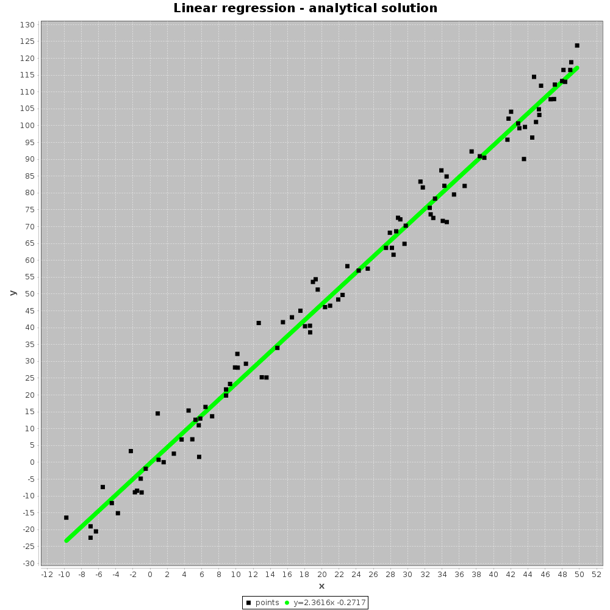
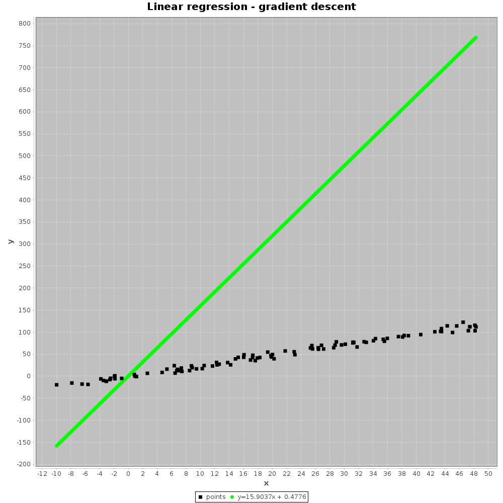
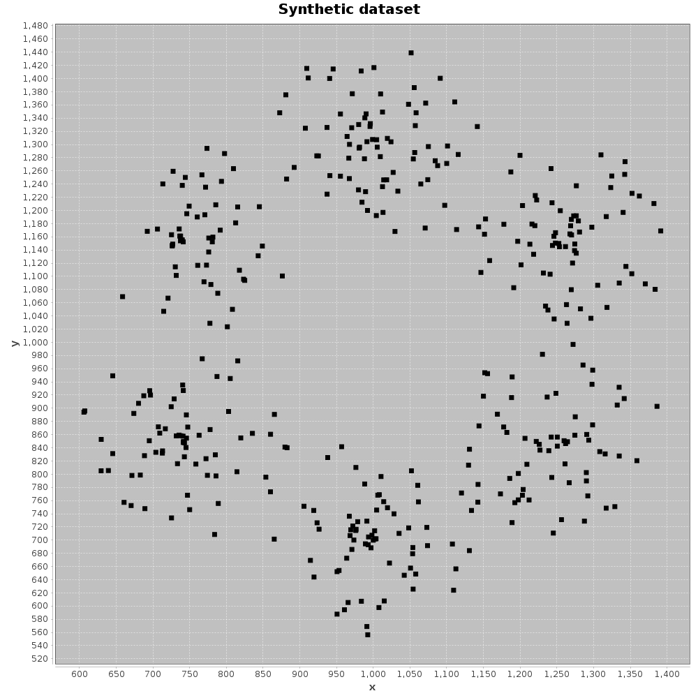

## Lineárna regresia a zhluky
[Home](../)

Prvou časťou tejto úlohy je lineárna regresia, respektíve implementácia algoritmov pre hľadanie parametrov `a` a `b` funkcie, podľa ktorej vstupné dáta vznikli. Najjednoduchšou časťou bola implementácia analytického spôsobu, ktorý na učenie parametrov `a` a `b` využíval vzorec. Táto metóda je celkom rýchla a aj presná, pre vstup zo súboru `linreg.txt` vyzerá graf nasledovne (odhadnutý tvar funkcie je uvedený pod grafom, v legende):

<p align="center"><a href="../iv122_outputs/assignment11/linreg-analytic-file.png"></a></p>

Na nasledujúcom obrázku je možné vidieť aplikáciu analytického spôsobu na funkciu `y=2.4x-1`:

<p align="center"><a href="../iv122_outputs/assignment11/linreg-analytic-synthetic.png"></a></p>

Následne som implementoval algoritmus gradient descent. Na tomto obrázku je vidiet postup tohto algoritmu na dátach zo súboru `linreg.txt`:

<p align="center"><a href="../iv122_outputs/assignment11/gifs/gd-file.gif"></a></p>

Nasledujúce dva obrázky zorazujú grafy pre tú istú konfiguráciu syntetických dát (`y=2.4x-1`; 100 hodnôt, 70 iterácií), s tým rozdielom, že na prvom obrázku je parameter `learningRate` nastavený na jednu milióntinu a na druhom obrázku je tento parameter o 2 rady väčší:

<p align="center"><a href="../iv122_outputs/assignment11/gifs/gd-synthetic.gif"></a></p>

<p align="center"><a href="../iv122_outputs/assignment11/gifs/gd-synthetic-bad.gif"></a></p>

Na týchto obrázkoch je vidieť vplyv `learningRate` na to, či nám riešenie bude konvergovať. Z obrázka je vidno, že program veľakrát "prestrelí" dané hodnoty `a` a `b`. (Na obrázkoch je znázornených 70 iterácií.)

Druhá časť úlohy bola implementovať algoritmus `k-means` na hľadanie zhlukov v dátach. Môj algoritmus opäť podporuje dáta zo súboru aj generovanie vlastných syntetických dát. Tento algoritmus je závislý na iniciálnych podmienkach, hlavne na vhodne zvolených stredoch zhlukov. V mojej implementácii vyberám ako počiatočné stredy zhlukov náhodná body z vstupného datasetu.

Nasledujúca animácia zobrazuje nájdenie zhlukov v dátach zo súboru `faithful.txt`:

<p align="center"><a href="../iv122_outputs/assignment11/gifs/clusters-file.gif"></a></p>

Algoritmu sa podarí nájsť zhluky na 3 iterácie (počet iterácií opäť záleží na iniciálnej konfigurácii, avšak program je vždy konečný!). Nasledujúca animácia zobrazuje hľadanie zhlukov v datasete s konfiguráciou 6 zhlukov, 400 bodov, maximálna vzdialenosť bodov od stredu zhluku (ktorý je na kružnici opísanej `n`-uholníku, kde `n` je počet zhlukov) je 150:

<p align="center"><a href="../iv122_outputs/assignment11/gifs/clusters-synthetic.gif"></a></p>

Funkcia na hľadanie zhlukov má nasledujúcu hlavičku: 

```kotlin
fun findClustersKMeans(points: List<Coordinates>, n: Int, chartName: String, targetFile: (Int) -> File)
```
prvé dva parametre ovplyvňujú výsledok algoritmu a posledné dva parametre boli pridané na zjednodušenie ukladania súborov. Náhodné dáta pre `k-means` generuje ako okolie vrcholov pravidelného `n`-uholníka. Vytvorenie `n`-uholníka robím pomocou funkcie `generateRegularNPolygon` z cvičenia 6. Funkcia an generovanie dát vyzerá nasledovne:

```kotlin
fun generateClustersDataSet(n: Int, radius: Double, center: Coordinates, clusterRadius: Double, totalPoints: Int): List<Coordinates> {
    val centersRandom = Random()
    val otherRandom = Random()
    val centers = generateRegularNPolygon(n, radius, center)
    val result = mutableListOf<Coordinates>()
    totalPoints.timesRepeat {
        val whichCenter = centersRandom.nextInt(n)
        val targetCenter = centers[whichCenter]
        val randomAngle = otherRandom.nextDouble() * 360
        val angleRadians = Math.toRadians(randomAngle)
        val distance = clusterRadius * otherRandom.nextDouble()
        result.add(Coordinates(targetCenter.x + distance * Math.sin(angleRadians), targetCenter.y + distance*Math.cos(angleRadians)))
    }
    return result
}
```
Body, ktoré patria enjakému zhluku generuje tak, že najskôr vygenerujem uhol (0-360°) a následne vzdialenosť. Do výsledného zoznamu potom pridávam nový vrchol, ktorý je od stredu vzdialený uvedenú vzdialenosť.


##### Výstup z konsole po spustení jar archívu sa nachádza [tu](./console-output.md)
##### Všetky ostatné obrázky(výstupy) k tejto úlohe sa nachádzajú na [Github-e](https://github.com/mseleng/iv122/tree/gh-pages/iv122_outputs/assignment11)
##### Všetky ostatné kódy k tejto úlohe sa nachádzajú na [Github-e](https://github.com/mseleng/iv122/tree/gh-pages/src/com/github/mseleng/iv122/assignment11)
##### Dokumentácia ku kódu sa nachádza [tu](../javadoc/iv122/com.github.mseleng.iv122.assignment11)