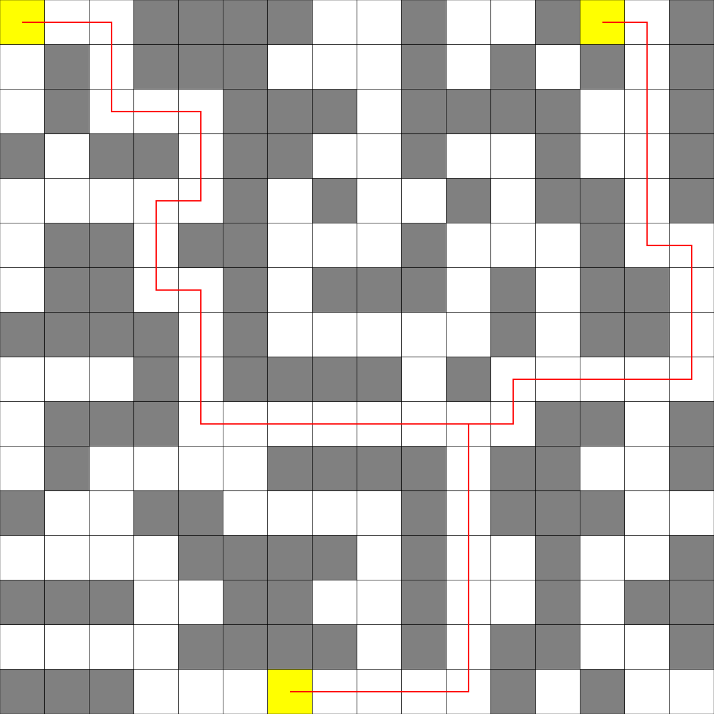

## Lineárna regresia a zhluky
[Home](../)

Implementácia číselného bludiska bola jednoduchá:
```kotlin
fun createNumberMazeGraph(numbers: List<List<Int>>): Graph<Int> {
    val justNodes = numbers.mapIndexed { y, list ->
        list.mapIndexed { x, number ->
            Node(number, Coordinates(x, y))
        }
    }.flatten() // List<Node>

    // now we need to compute edges/neighbors
    for (node in justNodes) {
        val range = node.value
        val neighbors = listOf(
                Coordinates(0, range) + node.coordinates,
                Coordinates(0, -range) + node.coordinates,
                Coordinates(range, 0) + node.coordinates,
                Coordinates(-range, 0) + node.coordinates)
                .map { justNodes.firstOrNull { node -> node.coordinates == it } }
                .filterNotNull()
        node.neighbors = neighbors.toSet()
    }
    return Graph(justNodes)
}
```

Na demonštráciu som využil bludisko zo slajdov. Chýba však dôkaz jednoznačnosti nájdenej cesty (nevedel som, ako sa dá jednoznačnosť dokázať). Možný dôkaz by spočíval v opakovanom spušťaní BFS na rôzne podgrafy vstupného grafu, resp. na vstupný graf, s tým, že by sa po každej iterácii nejakým spôsobom upravili hrany (napr. už použité hrany by sa z grafu odstránili, a podobne).

Výstup z bludiska (cesta z ľavého horného rohu do pravého spodného rohu) je vo [výstupe z konsole](./console-output.md).
 

Druhou úlohou bola implementácia ľubovoľného bludiska zo slajdov (alebo nejakého podľa vlastného výberu). Ja som sa rozhodol implementovať bludisko s lampami, tj. riešiť problém, ako efektívne spojiť 3 lampy. Efektívnym spojeníms a v tomto prípade myslí využitie čo anjmenšieho počtu políčok.

Textový vstup pre jedno také bludisko:
```text
A..####..#..#B.#
.#.###...#.#.#.#
.#...###.####..#
#.##.##..#..#..#
.....#.#..#.##.#
.##.##...#...#..
.##..#.###.#.##.
####.#.....#.##.
...#.####.#.....
.###........##.#
.#....####.##..#
#..##....#.###..
....####.#..#..#
###..##..#..#.##
....####.#.##..#
###...C....#.#..
```

kde znak `'.'` reprezentuje prázdne miesto, znak `'#'` reprezentuje stenu a čokoľvek iné (v tomto prípade písmená A, B a C) reprezentuje lampu.

SVG súbor s bludiskom a riešením:

<p align="center"><a href="../iv122_outputs/assignment12/lamps.svg"></a></p>


##### Výstup z konsole po spustení jar archívu sa nachádza [tu](./console-output.md)
##### Všetky ostatné obrázky(výstupy) k tejto úlohe sa nachádzajú na [Github-e](https://github.com/mseleng/iv122/tree/gh-pages/iv122_outputs/assignment12)
##### Všetky ostatné kódy k tejto úlohe sa nachádzajú na [Github-e](https://github.com/mseleng/iv122/tree/gh-pages/src/com/github/mseleng/iv122/assignment12)
##### Dokumentácia ku kódu sa nachádza [tu](../javadoc/iv122/com.github.mseleng.iv122.assignment12)