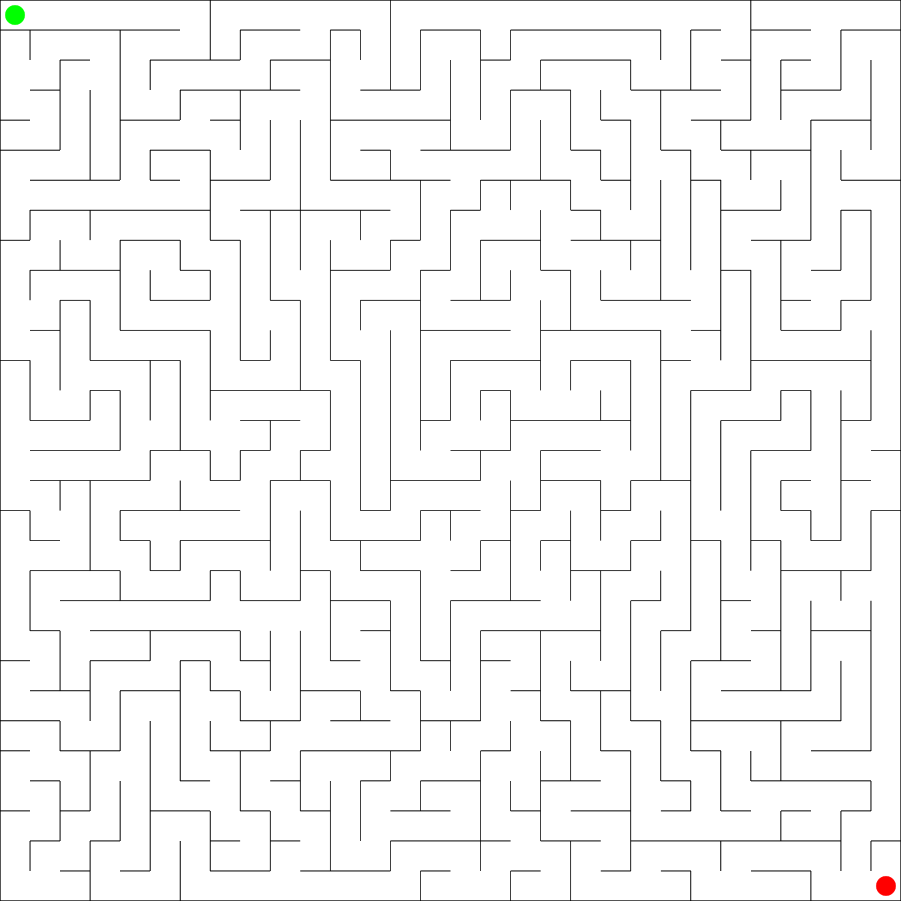
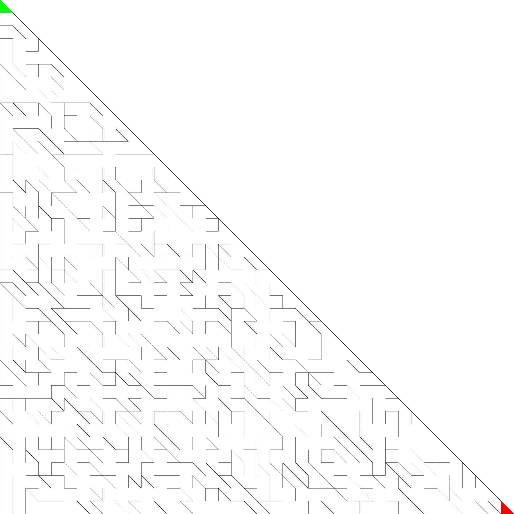

## Generovanie bludísk
[Home](../)

Posledná úloha bola zameraná na generovanie bludísk. V tejto úlohe som napísal programz na generovanie perfektných bludísk na štvorcovel a trojuholníkovej mriežke.

Bludisko na štvorcovej mriežke som vzgeneroval pomocou DFS algoritmu. Reprezentácia mriežky ako grafu bola triviálna: jedno políčko bludiska bolo reprezentované uzlom grafu a hrany, ktoré oddeľovali toto políčko boli reprezentované ako zoznam súradníc ([-1;0], [1;0], [0;-1], [0;1]).

Vygenerované bludisko:

<p align="center"><a href="../iv122_outputs/assignment13/square-1.svg"></a></p>

U bludiska na trojuholníkovej mriežke ol prvý problém to, ako ho reprezentovať ako graf. Na rozdiel od štvorcového bludiska, kde malo každé políčko rovnaký tvar, tu bolo treba uvažovať dva rôzne tvary políčok. Nakoniec som sa rozhodol pre nasledovnú implementáciu:

```text
    |\
    | \
 0  |0 \
    |---\
    |\ 1|\
 1  | \ | \
    |0 \|2 \
    |---+---\
```

Číslo vedľa riadku označuje y-ovú súradnicu všetkých políčok v danom riadku a číslo vovnútri trojuholníka označuje jeho x-ovú súradnicu. Vďaka tomuto označeniu viem jednoducho indexovať každý trojuholník.

Z dôvodu, že sú tu prítomné 2 rôzne typy políčok (a teda aj 2 možnosti "susedov"), rozhodol som sa, že trojuholníkové bludisko budem generovať Kruskalovým algoritmom. Vybral som si ho pretože mu na vstupe stačí len zoznam hrán a množina komponentov (na začiatku je počet komponentov rovný počtu políčok). Moja implementácia vyzerá nasledovne:

```kotlin
fun kruskal(edges: MutableList<Edge>, components: MutableList<Set<Coordinates>>): List<List<Edge>> {
    val random = Random()
    val tmp = mutableListOf<Edge>()
    tmp.addAll(edges)
    val result = mutableListOf(tmp)
    while (components.count() > 1) {
        val index = random.nextInt(edges.count())
        val randomEdge = edges[index]
        val firstSet = components.filter { it.contains(randomEdge.first) }.firstOrNull()
        val secondSet = components.filter { it.contains(randomEdge.second) }.firstOrNull()
        if (firstSet == null || secondSet == null) {
            edges.remove(randomEdge)
            continue
        }
        // if the random edge separates two different components, join them!
        if (firstSet != secondSet) {
            val jointSet = mutableSetOf<Coordinates>()
            jointSet.addAll(firstSet)
            jointSet.addAll(secondSet)
            components.remove(firstSet)
            components.remove(secondSet)
            components.add(jointSet)
            edges.remove(randomEdge)
            val newList = mutableListOf<Edge>()
            newList.addAll(edges)
            result.add(newList)
        }
    }
    return result
}
```

Táto implementácia nie je časovo efektívna, pretože využíva len množiny a zoznamy. Keďže som však nenašiel rozumnú implementáciu Union-Find dátovej štruktúry, rozhodol som sa to implementovať takto jednoducho.

Nasledujúca animácia ilustruje beh Kruskalovho algoritmu na trojuholníkovom bludisku o veľkosti 20x20 štvorcov:

<p align="center"><a href="../iv122_outputs/assignment13/gifs/kruskal.gif"></a></p>

Ďalšie bludisko generované Kruskalovým algoritmom:

<p align="center"><a href="../iv122_outputs/assignment13/triangle-1.svg"></a></p>

Kruskalov algoritmus, respektíve moja implementácia by mala ísť bez problémov použiť na akýkoľvek tvar bludiska.


##### Výstup z konsole po spustení jar archívu sa nachádza [tu](./console-output.md)
##### Všetky ostatné obrázky(výstupy) k tejto úlohe sa nachádzajú na [Github-e](https://github.com/mseleng/iv122/tree/gh-pages/iv122_outputs/assignment13)
##### Všetky ostatné kódy k tejto úlohe sa nachádzajú na [Github-e](https://github.com/mseleng/iv122/tree/gh-pages/src/com/github/mseleng/iv122/assignment13)
##### Dokumentácia ku kódu sa nachádza [tu](../javadoc/iv122/com.github.mseleng.iv122.assignment13)