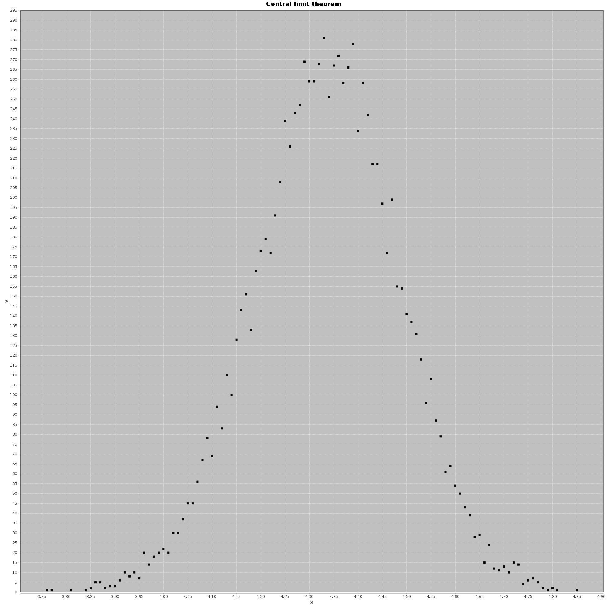
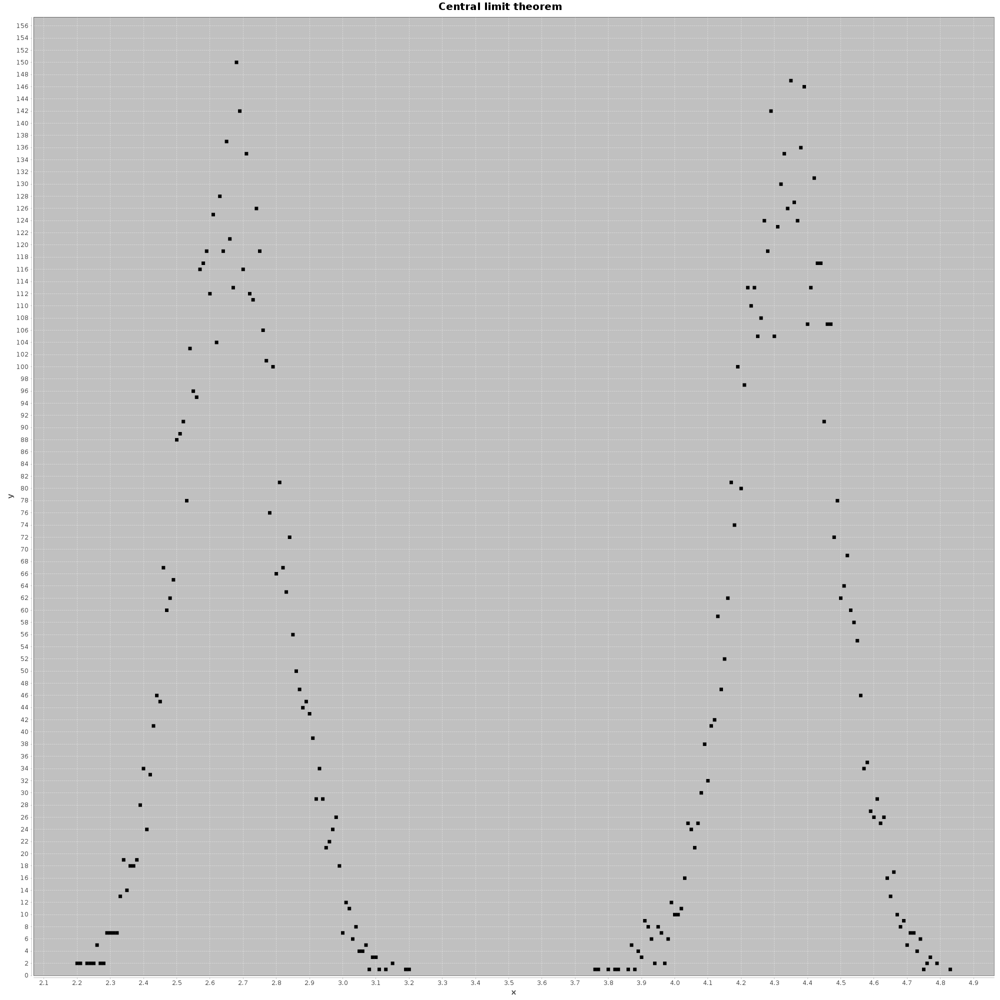

## Pravdepodobnosť
[Home](../)

Témou tohto cvičenia bola pravdepodobnosť a analýza dát. Provou úlohou bolo implementovať simulátor hry Monty Hall. Moja impplementácia vyzerá nasledovne:

```kotlin
enum class MontyHallChoice { STAY, CHANGE, WHATEVER }

fun montyHall(iterations: Int, choice: MontyHallChoice): Double {
    var successful = 0
    iterations.timesRepeat {
        val doorWithPrize = Random().nextInt(3)
        val yourChoice = Random().nextInt(3)
        // host opens the door...
        when (choice) {
            MontyHallChoice.STAY -> {
                if (doorWithPrize == yourChoice) {
                    successful++
                }
            }
            MontyHallChoice.CHANGE -> {
                if (doorWithPrize != yourChoice) {
                    successful++
                }
            }
            MontyHallChoice.WHATEVER -> {
                if (Random().nextInt(2) == 0) {
                    successful++
                }
            }
        }
    }

    return successful.toDouble() / iterations
}
```
Táto funkcia vracia pravdepodobnosť úspechu v prípade, že sa hráč rozhodne ponechať svoju voľbu, alebo ju zmeniť, alebo mu na nej nezáleží (enum `MontyHallChoice`). Simulácia vracia očakávané výsledky a je možné ich nájsť vo [výstupe z konsole](./console-output.md).

Ďalšou úlohou bolo určiť, či dané postupnosti čísel sú náhodné alebo nie. S touto úlohou som sa celkom zasekol, keďže sa mi dlho nedarilo nájsť žiadnu pravidelnosť (okrem prvého prípadu, kde bolo na prvý pohľad vidieť, že sa len dokola opakujú permutácie čísel 1 až 6). Závery ku ktorým som dospel sú tiež vo [výstupe z konsole](./console-output.md). Stručne povedané, pomocou bežného textového editora som odhalil opakujúce sa sekvencie čísel v predposlednom a poslednom súbore. V druhom súbore som odhalil, že "kocka", ktorá túto postupnosť vygenerovala bola nepoctivá a to takým spôsobom, že mala stenu s číslom 5 ťažšiu než stenu s číslom 2 (to by vysvetľovalo fakt, že počet pätiek bol trikrát vyšší, než počet dvojek). V prípadoch 3, 4 a 5 sa mi nepodarilo nájsť žiadne pravidelnosti. Skúšal som rôzne funkcie tabuľkového kalkulátora a taktiež vykresliť si graf (ak by náhodou boli položky nejak pravidelne usporiadané), avšak nič som nezistil.

Treťou úlohou bol experiment s centrálnou limitnou vetou, kde bolo treba na príklade so zaťaženými kockami nasimulovať rozloženie priemerov týchto kociek. Zaujímavý výsledok vznikol v prípade, kde sa kocka náhodne vyberie pred každou iteráciou. V tomto prípade má graf tvar akéhosi dvojitého normálneho rozdelenia. Nižšie sú zobrazené niektoré výstupy:

  + Prípad, ak po celý čas hádžeme len kockou A:

<p align="center"><a href="../iv122_outputs/assignment10/clt1.png"></a></p>

  + Prípad, ak sa pred každým hodom náhodne rozhodneme, ktorú kocku budeme hádzať:
  
<p align="center"><a href="../iv122_outputs/assignment10/clt2.png"></a></p>

  + Prípad, kde si kocku náhodne vyberieme pred každou iteráciou a potom túto kocku hádžeme `n`-krát:
  
<p align="center"><a href="../iv122_outputs/assignment10/clt3.png"></a></p>

Poslednou úlohou bolo implementovať experiment/simuláciu na výpočet pravdepodobností a ďalej tú istú pravdepodobnosť vypočítať Bayesovou vetou. Výpočet pomocou Bayesovej vety bol jednoduchý, taktiež aj implementácia experimentu. Avšak výstupy z experimentu sa celkom výrazne odlišujú od výstupov z Bayesovej vety. Moja implementácia experimentu:

```kotlin
fun experimentForCubes(n: Int, x: Int, iterations: Int): Double {
    var successes = 0
    val random = Random()
    val badCube = random.nextInt(n) // which one is bad
    iterations.timesRepeat {
        // one iteration is an equivalent of choosing a cube from the bag
        val randomCube = random.nextInt(n) // randomly choose a cube
        // check if all x throws gave 6s (in our case 5, because 0->5)
        if ((1..x).map { random.nextInt(6) }.all { it == 5 } && badCube != randomCube) {
            successes++
        }
    }
    return successes.toDouble() / iterations
}
```

Myslím, že tento program odpovedá experimentu, ktorý by sa robil reálne a preto si nie som istý, kde (a či vôbec) je chyba. Úryvok z [výstupu z konsole](./console-output.md), ktorý sa týka práve tejto podúlohy:
```text
-> Bayes theorem and simulations:
	N=100; X=3; 1 million iterations for experiment:
		experiment: 0.004594
		bayes:      0.3142857142857142
	N=10; X=5; 1 million iterations for experiment:
		experiment: 1.06E-4
		bayes:      0.0011560693641618494
	N=10; X=3; 1 million iterations for experiment:
		experiment: 0.004171
		bayes:      0.03999999999999999
	N=10; X=1; 1 million iterations for experiment:
		experiment: 0.149742
		bayes:      0.6
```

##### Výstup z konsole po spustení jar archívu sa nachádza [tu](./console-output.md)
##### Všetky ostatné obrázky(výstupy) k tejto úlohe sa nachádzajú na [Github-e](https://github.com/mseleng/iv122/tree/gh-pages/iv122_outputs/assignment10)
##### Všetky ostatné kódy k tejto úlohe sa nachádzajú na [Github-e](https://github.com/mseleng/iv122/tree/gh-pages/src/com/github/mseleng/iv122/assignment10)
##### Dokumentácia ku kódu sa nachádza [tu](../javadoc/iv122/com.github.mseleng.iv122.assignment10)