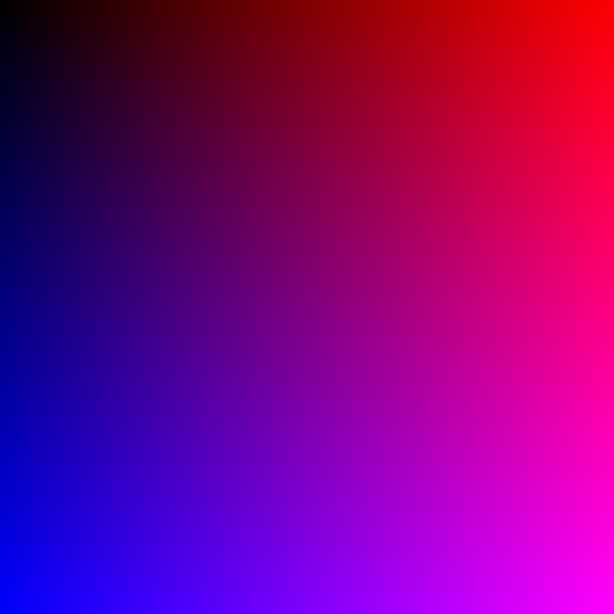
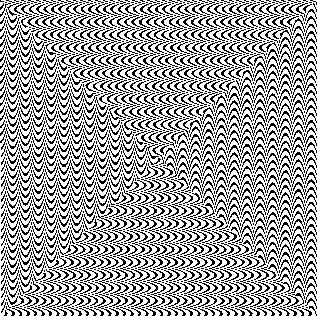

## Rozcvička
[Home](../)

Úlohou prvého cvičenia bolo pripraviť si (vlastné) knižnice na prácu s bitmapovou a vektorovou grafikou.

Ja som sa rozhodol, že cvičenia bude vypracovávať v [Kotline](https://www.kotlinlang.org), pretože je to moderný jazyk a považujem ho za sľubnú alternatívu k "príliš objektovej a ukecanej" Jave.

Keďže som nenašiel žiadnu knižnicu, ktorá by vedela pracovať s vektorovou grafikou a bola by jednoduchá, rozhodol som sa napísať si vlastnú ([trieda `SVG`](../javadoc/iv122/com.github.mseleng.iv122.util/-s-v-g)).

Pre prácu s bitmapovou grafikou (zatial len operácie čítania) som si rozšíril funkcionalitu Javovskej triedy `BufferedImage` ([rozširujúce funkcie](../javadoc/iv122/com.github.mseleng.iv122.util/java.awt.image.-buffered-image)).

Pre prácu s grafmi som sa rozhodol využiť externú knižnicu `jfreechart` (a jej závislosť `jcommon`), ktorú som taktiež rozšíril o pomocné funkcie ([trieda `Chart`](../javadoc/iv122/com.github.mseleng.iv122.util/-chart)).

Príklady v tomto cvičení boli zamerané na vyskúšanie a demonštráciu funkcií týchto "knižníc"

* Na demonštráciu práce s bitmapovou grafikou bolo za úlohu vytvoriť farebný gradient. Na počítanie farieb bola použitá bilineárna interpolácia a tu je výsledok: 
    
    
```kotlin
fun linearInterpolation(x: Int, width: Int, firstValue: Double, secondValue: Double): Double {
    val ratio = fraction(x, width)
    return (1 - ratio) * firstValue + ratio * secondValue
}
      
fun bilinearInterpolation(x: Int, y: Int, width: Int, height: Int, tl: Int, tr: Int, bl: Int, br: Int): Double {
    return linearInterpolation(
                y,
                height,
                linearInterpolation(x, width, tl.toDouble(), tr.toDouble()),
                linearInterpolation(x, width, bl.toDouble(), br.toDouble()))
}
```

* Ďalšia úloha bola vytvoriť Ulamovu špirálu, prípadne variácie na ňu. Ja som experimentoval s podmienkami, podľa ktorých boli vyfarbované jednotlivé políčka dostal som zaujímavé výsledky. Tu je Ulamova špirála, kde podmienka pre zafarbenie čísla `x` bola nasledovná: `x * e % π >= 2`:
    
    
```kotlin
/*
    Trieda UlamSpiralCondition je alias pre funkciu, ktorá ma parameter celé číslo a vracia boolean.
    Táto podmienka sa používa pri rozhodovaní, či sa dané číslo zafarbí alebo nie
*/
fun getUlamsSpiral(n: Int, condition: UlamSpiralCondition): BufferedImage {
    val dimensions = computeDimensions(n)
    return bitmapImage(dimensions.first, dimensions.second) {
        val center = computeCenter(dimensions.first, dimensions.second)
        var lastCoordinates: Coordinates? = null
        var lastDirection: Direction? = null
        for (i in 1..n) {
            val rgb = if (condition(i)) { Color.BLACK.rgb } else { Color.WHITE.rgb }
            val (coordinates, direction) = getNextMove(center, lastCoordinates, lastDirection)
            lastCoordinates = coordinates
            lastDirection = direction
            if (lastCoordinates.isOutOfRange(dimensions.first, dimensions.second)) {
                continue
            }
            setRGB(lastCoordinates.x.toInt(), lastCoordinates.y.toInt(), rgb)
        }
    }
}
```

* Posledné dve úlohy boli vizualizovať Collatzovu postupnosť a Euklidov algoritmus pre spočítanie najmenšieho spoločného deliteľa
    - Grafy Collatzovej postupnosti je možné nájsť [tu](../iv122_outputs/assignment1/collatz.png), respektíve [tu](../iv122_outputs/assignment1/collatz-max.png)
    - Grafy vizualizácie beh Euklidovho algoritmu je možné nájsť [tu](../iv122_outputs/assignment1/euclid-[modulus].png), respektíve [tu](../iv122_outputs/assignment1/euclid-[subtraction].png).
    Grafy vizualizácie Euklidovho algoritmu farebne zobrazujú počty krokov potrebné k výpočtu najväčšieho spoločného deliteľa čísel x a y. Farebná legenda bola schválne ponechaná na obidvoch grafoch rovnaká, aby bolo jasne vidiet, že algoritmus, ktorý odčíta 2 čísla beží dlhšie než algoritmus, ktorý efektívne robí operáciu modulo.
    
```kotlin
/* 
    funkcia, ktorá počíta najmenší spoločný deliteľ dvoch zadaných čísel pomocou operácie modulo (rem)
    Trieda EuclidSolution je len typealias pre pár (najmenší_spoločný_deliteľ, počet_krokov)
*/
fun euclidMod(x: Long, y: Long): EuclidSolution {
    if (y == 0L) {
        return EuclidSolution(x, 1)
    } else {
        return euclidMod(y, x.rem(y)).let { EuclidSolution(it.gcd, it.steps + 1) }
    }
}
```
    
#### Všetky ostatné kódy k tejto úlohe sa nachádzajú na [Github-e](https://github.com/mseleng/iv122/tree/gh-pages/src/com/github/mseleng/iv122/assignment1)
#### Dokumentácia ku kódu sa nachádza [tu](../javadoc/iv122/com.github.mseleng.iv122.assignment1)